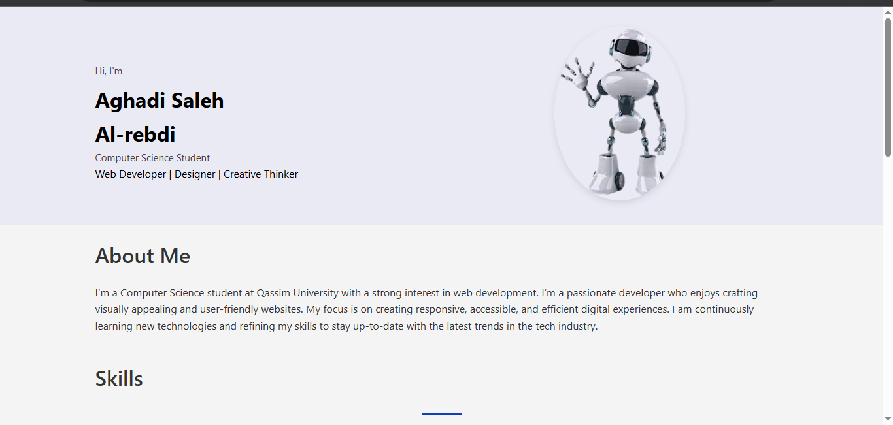

# Web Portfolio 

**Project Title**  
Personal Portfolio Website for Aghadi Saleh Al-rebdi

---

## Objective  
The goal of this project is to create a clean, responsive personal portfolio website using semantic HTML and CSS. The site effectively showcases my skills, projects, and professional background while providing an intuitive user experience across all devices.

---

##  Description  
The portfolio website consists of the following key sections:

### Welcome
A warm introductory section featuring:
- Clean, minimalist banner with my name and professional title
- Friendly greeting message ("Hello! I'm Aghadi]")

### About Me
A concise professional introduction

### Skills
An organized display of my technical capabilities

### Projects
Featured work samples presented with pictures and information about them

### Contact Me
Easy communication options by clicking the "Contact me" button

---

## Key features:
- Logical flow from introduction to contact
- Semantic HTML structure
- CSS Flexbox/Grid layouts
  
---

## Tools and Platform  
- **Platform**: Visual Studio Code 
- **Languages**: HTML5, CSS3  
- **Design Techniques**:
  - Flexbox layout
  - Responsive design via media queries
  - Reusable CSS classes  
- **Contact Method**: `mailto:` protocol with a styled anchor tag acting as a button

---

## Created By  
**Student Name**: Aghadi Saleh Al-rebdi  
**University**: Qassim University  
**Department**: Computer Science  
**Year**: 2025  

---

## Code Snippet (Email Button)
Below is the code for the email button that opens the user's email client with prefilled subject and body:

```html
<a href="mailto:Aghadialrebdi@gmail.com?subject=Contact from Website&body=Hi Aghadi," class="email-button">Send Message</a>
```

---

## Project Screenshot  
Below is a screenshot of the final website in a live server:

)
